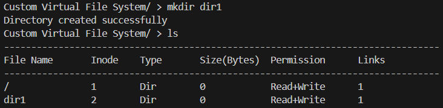

# Custom Virtual File System (CVFS)

---

## 📌 Project Overview
This project is an implementation of a **Custom Virtual File System (CVFS)** in C/C++.  
It emulates many functionalities of a real operating system’s file system but keeps all records in **primary memory (RAM)**, hence it is called *virtual*.  

The CVFS supports:

File management (creat, open, read, write, close, unlink).

Directory management (mkdir, rmdir, cd, ls).

Metadata retrieval (stat, fstat, chmod, find).

File navigation (lseek).

Utility commands (help, man, clear, exit, mkfs).
---

## ⚙️ Technologies Used
- **Programming Language**: C / C++  
- **Compiler**: GCC / g++  
- **Platform**: Windows/Linux terminal  

---

## 🖥️ User Interface
- Console-based shell called **Marvellous CVFS**.  
- User enters commands similar to UNIX shell.  
- Provides built-in help and man pages.  

# Project Architecture
---

## Figure 1: Disk Layout
  
**Description:** Disk layout showing Boot Block, Super Block, Disk Inode List Block (DILB), and Data Blocks (DB).

---

## Figure 2: File Handling Flow
  
**Description:** Flow of file handling from UAREA → File Table → Incore Inode Table → DILB → DB.

## 🏗️ Core Data Structures

### 1. **BootBlock**
- Stores information required to boot the file system.  
- Simulates the boot process of an OS.  

---

### 2. **SuperBlock**
- Tracks free and total inodes in the system.  
- Works like a control structure for the filesystem.  

**Fields:**
- `TotalInodes` → Maximum number of files/directories that can exist.  
- `FreeInodes` → Remaining inodes available for allocation.  

---

### 3. **Inode (Index Node)**

An **inode** represents each file or directory and stores its metadata. It functions similarly to UNIX inodes, providing essential information about files and directories. Each file/directory has a **unique inode**.

#### **Fields of an Inode**

- **FileName** → Name of the file or directory  
- **InodeNumber** → Unique identifier for the inode  
- **FileSize** → Maximum allocated size (default: 100 bytes)  
- **ActualFileSize** → Current size in use  
- **FileType** → Specifies if it is a regular file or a directory  
- **LinkCount** → Number of hard links to the file  
- **ReferenceCount** → Number of active references (open handles)  
- **Permission** → File access permissions (Read, Write, Read+Write)  
- **Buffer** → Actual memory block storing the data  

#### **Additional for Directory Inodes**
- Maintain **parent**, **child**, and **sibling** references to manage directory structure efficiently.


---

### 4. **FileTable**
- Tracks opened files and offsets.  
- Maintains per-file session details like file descriptors.  

**Fields:**
- `ReadOffset`  
- `WriteOffset`  
- `Mode` (Read / Write / Read+Write)  
- `ptrinode` → Pointer to the inode of the opened file  

---

### 5. **UAREA (User Area)**
- Represents process-level file management structure (like PCB).  
- Contains process info and User File Descriptor Table (UFDT).  

**Fields:**
- `ProcessName`  
- `CurrentDirectory`  
- `UFDT[]` → Array of FileTables for open files  

---

## 📜 Commands in CVFS

| Command | Category | Description |
|---------|----------|-------------|
| `help` | Utility | Displays the list of available commands |
| `man <cmd>` | Utility | Displays usage & details of a command |
| `creat <filename> <permission>` | File Mgmt | Creates a new file with given permissions (1=Read, 2=Write, 3=Read+Write) |
| `open <filename> <mode>` | File Mgmt | Opens an existing file in specified mode |
| `close <fd>` | File Mgmt | Close an opened file  |
| `write <fd>` | File Mgmt | Writes data to a file using file descriptor |
| `read <fd> <size>` | File Mgmt | Reads given bytes from a file |
| `unlink <filename>` | File Mgmt | Deletes an existing file |
| `ls` | File Mgmt | Lists all files/directories with details |
| `stat <filename>` | File Mgmt | Shows metadata of a file |
| `fstat <fd>` | File Mgmt | Shows metadata using file descriptor |
| `chmod <filename> <permission>` | File Mgmt | Changes file permissions |
| `lseek <fd> <offset> <whence>` | File Mgmt | Changes read/write offsets in file |
| `mkdir <dirname>` | Dir Mgmt | Creates a directory |
| `rmdir <dirname>` | Dir Mgmt | Removes a directory |
| `cd <dirname>` | Dir Mgmt | Changes the current working directory |
| `find <filename>` | Utility | Search file in CVFS   |
| `clear` | Utility | Clears console |
| `exit` | Utility | Saves file system to secondary storage and exits |


---
📷 Screenshots (Demonstration)

Below are  use-cases with placeholders where you can add the screenshots you already captured:

# Project Flow Screenshots


---

## 1. Help and Exit


---

## 2. Create and List Files


---

## 3. Write and Read File


---

## 4. Stat and Fstat


---

## 5. Change Permission


---

## 6. Lseek and Read


---

## 7. Close and Unlink


---

## 8. Directory Operations
  
  


---

## 9. Error Handling


---

## 10. Find File


---
## 🛠️ How to Run

1. **Compile the program:**
   ```bash
   g++ CVFS.cpp -o cvfs
   ```
2 . **Run the executable:**
   ```bash
   ./cvfs
   ```
3 . **Start entering commands in the Marvellous CVFS shell.**
